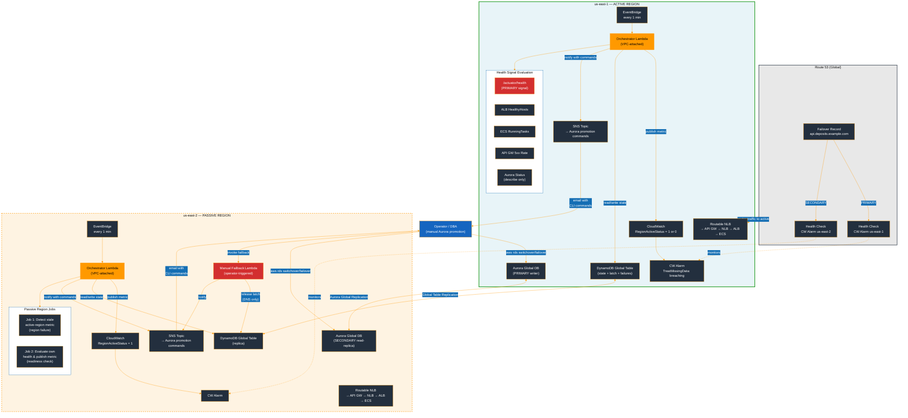

```mermaid
%%{init: {'theme': 'base', 'themeVariables': { 'primaryColor': '#232F3E', 'primaryTextColor': '#fff', 'primaryBorderColor': '#FF9900', 'lineColor': '#FF9900', 'secondaryColor': '#146EB4', 'tertiaryColor': '#f0f0f0'}}}%%

flowchart TB
    subgraph R53["Route 53 (Global)"]
        direction LR
        FR["Failover Record<br/>api.deposits.example.com"]
        HC1["Health Check<br/>CW Alarm us-east-1"]
        HC2["Health Check<br/>CW Alarm us-east-2"]
    end

    subgraph USE1["us-east-1 — ACTIVE REGION"]
        direction TB

        EB1["EventBridge<br/>every 1 min"]
        L1["Orchestrator Lambda<br/>(VPC-attached)"]

        subgraph SIGNALS1["Health Signal Evaluation"]
            direction LR
            HTTP1["/actuator/health<br/>(PRIMARY signal)"]
            ALB1["ALB HealthyHosts"]
            ECS1["ECS RunningTasks"]
            API1["API GW 5xx Rate"]
            AUR1["Aurora Status<br/>(describe only)"]
        end

        CW1["CloudWatch<br/>RegionActiveStatus = 1 or 0"]
        AL1["CW Alarm<br/>TreatMissingData: breaching"]
        DDB1["DynamoDB Global Table<br/>(state + latch + failures)"]
        AURORA1["Aurora Global DB<br/>(PRIMARY writer)"]
        SNS1["SNS Topic<br/>→ Aurora promotion commands"]
        NLB1["Routable NLB<br/>→ API GW → NLB → ALB → ECS"]
    end

    OPS["Operator / DBA<br/>(manual Aurora promotion)"]

    subgraph USE2["us-east-2 — PASSIVE REGION"]
        direction TB

        EB2["EventBridge<br/>every 1 min"]
        L2["Orchestrator Lambda<br/>(VPC-attached)"]

        subgraph PASSIVE_JOBS["Passive Region Jobs"]
            direction LR
            JOB1["Job 1: Detect stale<br/>active-region metric<br/>(region failure)"]
            JOB2["Job 2: Evaluate own<br/>health & publish metric<br/>(readiness check)"]
        end

        CW2["CloudWatch<br/>RegionActiveStatus = 1"]
        AL2["CW Alarm"]
        DDB2["DynamoDB Global Table<br/>(replica)"]
        AURORA2["Aurora Global DB<br/>(SECONDARY read-replica)"]
        SNS2["SNS Topic<br/>→ Aurora promotion commands"]
        NLB2["Routable NLB<br/>→ API GW → NLB → ALB → ECS"]

        FB["Manual Failback Lambda<br/>(operator-triggered)"]
    end

    EB1 --> L1
    L1 --> SIGNALS1
    L1 -->|"publish metric"| CW1
    CW1 --> AL1
    L1 -->|"read/write state"| DDB1
    L1 -->|"notify with commands"| SNS1

    EB2 --> L2
    L2 --> PASSIVE_JOBS
    L2 -->|"publish metric"| CW2
    CW2 --> AL2
    L2 -->|"read/write state"| DDB2
    L2 -->|"notify with commands"| SNS2

    FB -->|"release latch<br/>(DNS only)"| DDB2
    FB -->|"notify"| SNS2

    FR -->|"PRIMARY"| HC1
    FR -->|"SECONDARY"| HC2
    HC1 -.->|"monitors"| AL1
    HC2 -.->|"monitors"| AL2
    R53 -->|"routes traffic to active"| NLB1

    DDB1 <-->|"Global Table Replication"| DDB2
    AURORA1 <-->|"Aurora Global Replication"| AURORA2

    SNS1 -->|"email with<br/>CLI commands"| OPS
    SNS2 -->|"email with<br/>CLI commands"| OPS
    OPS -->|"aws rds switchover/failover"| AURORA1
    OPS -->|"aws rds switchover/failover"| AURORA2
    OPS -->|"invoke failback"| FB

    style USE1 fill:#e8f4f8,stroke:#2ca02c,stroke-width:3px
    style USE2 fill:#fef3e2,stroke:#ff9900,stroke-width:2px,stroke-dasharray: 5 5
    style R53 fill:#e8e8e8,stroke:#232F3E,stroke-width:2px
    style SIGNALS1 fill:#fff,stroke:#146EB4,stroke-width:1px
    style PASSIVE_JOBS fill:#fff,stroke:#146EB4,stroke-width:1px
    style HTTP1 fill:#d32f2f,color:#fff
    style FB fill:#d32f2f,color:#fff
    style L1 fill:#FF9900,color:#000
    style L2 fill:#FF9900,color:#000
    style OPS fill:#1565C0,color:#fff
```
