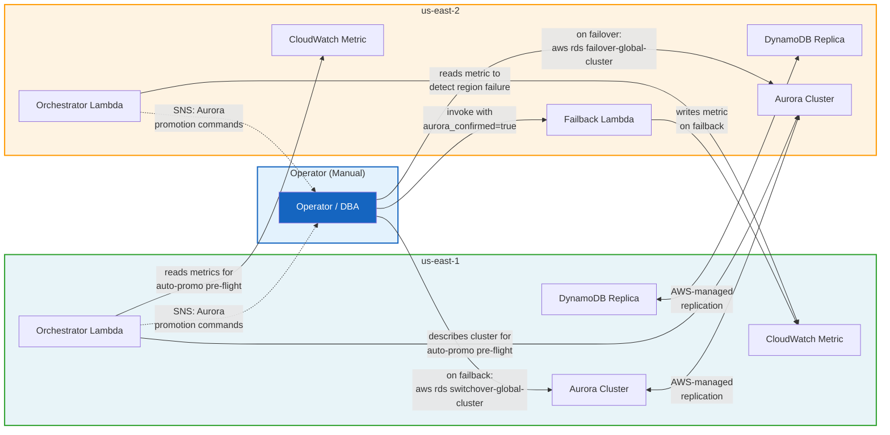

## Component Relationships — C4 Style

### Level 3: Component Diagram

```mermaid
flowchart TB
    subgraph GLOBAL["Global Services"]
        R53["Route 53<br/>Failover Record"]
        IAM["IAM Role<br/>failover-orchestrator-role-prod"]
    end

    subgraph USE1["us-east-1"]
        EB1["EventBridge Rule<br/>(every 1 min)"]
        ORCH1["Lambda: failover-orchestrator-prod<br/>(VPC-attached)"]
        FB1["Lambda: failover-manual-failback-prod<br/>(VPC-attached)"]
        SNS1["SNS Topic<br/>failover-notifications-prod"]
        CW_METRIC1["CloudWatch Custom Metric<br/>RegionActiveStatus"]
        CW_ALARM1["CloudWatch Alarm<br/>region-active-status-us-east-1-prod"]
        R53_HC1["Route 53 Health Check<br/>failover-health-us-east-1-prod"]
        SG1["Security Group<br/>failover-orchestrator-lambda-sg"]

        subgraph DDB["DynamoDB Global Table: failover-state"]
            DDB1["us-east-1 replica"]
        end

        subgraph EXISTING1["Your Existing Stack (us-east-1)"]
            ALB1["Private ALB<br/>/actuator/health"]
            ECS1["ECS Fargate Service"]
            APIGW1["Private API Gateway"]
            AURORA1["Aurora PostgreSQL"]
            NLB1["Routable NLB"]
        end
    end

    subgraph USE2["us-east-2"]
        EB2["EventBridge Rule<br/>(every 1 min)"]
        ORCH2["Lambda: failover-orchestrator-prod<br/>(VPC-attached)"]
        FB2["Lambda: failover-manual-failback-prod<br/>(VPC-attached)"]
        SNS2["SNS Topic<br/>failover-notifications-prod"]
        CW_METRIC2["CloudWatch Custom Metric<br/>RegionActiveStatus"]
        CW_ALARM2["CloudWatch Alarm<br/>region-active-status-us-east-2-prod"]
        R53_HC2["Route 53 Health Check<br/>failover-health-us-east-2-prod"]
        SG2["Security Group<br/>failover-orchestrator-lambda-sg"]

        subgraph DDB2_WRAP["DynamoDB Global Table: failover-state"]
            DDB2["us-east-2 replica"]
        end

        subgraph EXISTING2["Your Existing Stack (us-east-2)"]
            ALB2["Private ALB<br/>/actuator/health"]
            ECS2["ECS Fargate Service"]
            APIGW2["Private API Gateway"]
            AURORA2["Aurora PostgreSQL"]
            NLB2["Routable NLB"]
        end
    end

    OPS["Operator / DBA"]

    %% EventBridge triggers Lambda
    EB1 -->|"invokes"| ORCH1
    EB2 -->|"invokes"| ORCH2

    %% IAM assumed by all Lambdas
    IAM -.->|"assumed by"| ORCH1
    IAM -.->|"assumed by"| ORCH2
    IAM -.->|"assumed by"| FB1
    IAM -.->|"assumed by"| FB2

    %% Security groups attached to Lambdas
    SG1 -.->|"attached to"| ORCH1
    SG1 -.->|"attached to"| FB1
    SG2 -.->|"attached to"| ORCH2
    SG2 -.->|"attached to"| FB2

    %% Orchestrator Lambda interactions (active region)
    ORCH1 -->|"GET /actuator/health"| ALB1
    ORCH1 -->|"DescribeServices"| ECS1
    ORCH1 -->|"GetMetricStatistics"| APIGW1
    ORCH1 -->|"DescribeDBClusters"| AURORA1
    ORCH1 -->|"read/write state"| DDB1
    ORCH1 -->|"PutMetricData"| CW_METRIC1
    ORCH1 -->|"Publish"| SNS1

    %% Orchestrator Lambda interactions (passive region)
    ORCH2 -->|"GET /actuator/health"| ALB2
    ORCH2 -->|"read/write state"| DDB2
    ORCH2 -->|"PutMetricData"| CW_METRIC2
    ORCH2 -->|"GetMetricStatistics<br/>(staleness check)"| CW_METRIC1
    ORCH2 -->|"Publish"| SNS2

    %% Failback Lambda interactions
    FB2 -->|"read/write state"| DDB2
    FB2 -->|"DescribeDBClusters<br/>(verify writer)"| AURORA2
    FB2 -->|"PutMetricData"| CW_METRIC1
    FB2 -->|"PutMetricData"| CW_METRIC2
    FB2 -->|"Publish"| SNS2

    %% Operator interactions (MANUAL Aurora promotion)
    SNS1 -->|"email notifications<br/>with Aurora commands"| OPS
    SNS2 -->|"email notifications<br/>with Aurora commands"| OPS
    OPS -->|"aws rds switchover-global-cluster<br/>aws rds failover-global-cluster"| AURORA1
    OPS -->|"aws rds switchover-global-cluster<br/>aws rds failover-global-cluster"| AURORA2
    OPS -->|"invoke failback"| FB2
    OPS -->|"set aurora_promotion_pending=false"| DDB1

    %% Alarm watches metric
    CW_METRIC1 -->|"evaluated by"| CW_ALARM1
    CW_METRIC2 -->|"evaluated by"| CW_ALARM2

    %% Health check watches alarm
    CW_ALARM1 -->|"monitored by"| R53_HC1
    CW_ALARM2 -->|"monitored by"| R53_HC2

    %% Route 53 uses health checks
    R53_HC1 -->|"PRIMARY"| R53
    R53_HC2 -->|"SECONDARY"| R53

    %% Route 53 routes to NLBs
    R53 -->|"routes traffic"| NLB1
    R53 -->|"routes traffic"| NLB2

    %% DynamoDB replication
    DDB1 <-->|"Global Table<br/>replication"| DDB2

    %% Aurora replication
    AURORA1 <-->|"Aurora Global<br/>replication"| AURORA2

    %% Styling
    style GLOBAL fill:#f5f5f5,stroke:#333,stroke-width:2px
    style USE1 fill:#e8f4f8,stroke:#2ca02c,stroke-width:2px
    style USE2 fill:#fef3e2,stroke:#ff9900,stroke-width:2px
    style EXISTING1 fill:#fff,stroke:#999,stroke-dasharray: 5 5
    style EXISTING2 fill:#fff,stroke:#999,stroke-dasharray: 5 5
    style ORCH1 fill:#FF9900,color:#000
    style ORCH2 fill:#FF9900,color:#000
    style FB1 fill:#d32f2f,color:#fff
    style FB2 fill:#d32f2f,color:#fff
    style OPS fill:#1565C0,color:#fff
```

### Level 4: Signal Flow — What Triggers What

```mermaid
flowchart LR
    subgraph TRIGGER["Trigger Chain"]
        direction LR
        EB["EventBridge<br/>(1 min schedule)"]
        EB -->|"invokes"| LAMBDA["Orchestrator<br/>Lambda"]
    end

    subgraph EVALUATE["Lambda Evaluates"]
        direction TB
        HTTP["/actuator/health<br/>→ ALB"]
        CW_ALB["HealthyHostCount<br/>→ CloudWatch"]
        CW_ECS["RunningTasks<br/>→ ECS API"]
        CW_API["5xx Rate<br/>→ CloudWatch"]
        CW_AUR["Cluster Status<br/>→ RDS API"]
    end

    subgraph DECIDE["Lambda Decides"]
        direction TB
        COUNT["Increment or reset<br/>consecutive_failures<br/>→ DynamoDB"]
        CHECK["Check threshold<br/>+ cooldown + latch<br/>→ DynamoDB"]
    end

    subgraph ACT["Lambda Acts (DNS Only)"]
        direction TB
        METRIC["Publish<br/>RegionActiveStatus=0<br/>→ CloudWatch"]
        NOTIFY["Send Aurora commands<br/>→ SNS → Operator"]
        LATCH["Engage latch<br/>→ DynamoDB"]
    end

    subgraph REACT["AWS Reacts + Operator"]
        direction TB
        ALARM["CloudWatch Alarm<br/>evaluates metric"]
        HC["Route 53 Health Check<br/>reads alarm state"]
        DNS["Route 53 Failover Record<br/>routes traffic to secondary"]
        OPS["Operator promotes Aurora<br/>(manual CLI command)"]
    end

    LAMBDA --> EVALUATE
    EVALUATE --> DECIDE
    DECIDE -->|"healthy"| METRIC_OK["Publish<br/>RegionActiveStatus=1"]
    DECIDE -->|"threshold reached"| ACT
    ACT --> ALARM
    ALARM --> HC
    HC --> DNS
    NOTIFY --> OPS

    style OPS fill:#1565C0,color:#fff
```

### Level 4: Cross-Region Interactions

```mermaid
flowchart LR
    subgraph USE1["us-east-1"]
        ORCH1["Orchestrator Lambda"]
        CW1["CloudWatch Metric"]
        DDB1["DynamoDB Replica"]
        AUR1["Aurora Cluster"]
    end

    subgraph OPS_BOX["Operator (Manual)"]
        OPS["Operator / DBA"]
    end

    subgraph USE2["us-east-2"]
        ORCH2["Orchestrator Lambda"]
        CW2["CloudWatch Metric"]
        DDB2["DynamoDB Replica"]
        AUR2["Aurora Cluster"]
        FB2["Failback Lambda"]
    end

    %% Cross-region reads (automated)
    ORCH2 -->|"reads metric to<br/>detect region failure"| CW1
    ORCH1 -->|"reads metrics for<br/>auto-promo pre-flight"| CW2
    ORCH1 -->|"describes cluster for<br/>auto-promo pre-flight"| AUR2
    FB2 -->|"writes metric<br/>on failback"| CW1

    %% DynamoDB replication (automatic)
    DDB1 <-->|"AWS-managed<br/>replication"| DDB2

    %% Aurora replication (automatic)
    AUR1 <-->|"AWS-managed<br/>replication"| AUR2

    %% Aurora promotion (MANUAL by operator)
    OPS -->|"on failover:<br/>aws rds failover-global-cluster"| AUR2
    OPS -->|"on failback:<br/>aws rds switchover-global-cluster"| AUR1

    %% Operator receives commands from SNS
    ORCH1 -.->|"SNS: Aurora<br/>promotion commands"| OPS
    ORCH2 -.->|"SNS: Aurora<br/>promotion commands"| OPS

    %% Operator invokes failback
    OPS -->|"invoke with<br/>aurora_confirmed=true"| FB2

    style USE1 fill:#e8f4f8,stroke:#2ca02c,stroke-width:2px
    style USE2 fill:#fef3e2,stroke:#ff9900,stroke-width:2px
    style OPS_BOX fill:#e3f2fd,stroke:#1565C0,stroke-width:2px
    style OPS fill:#1565C0,color:#fff
```
